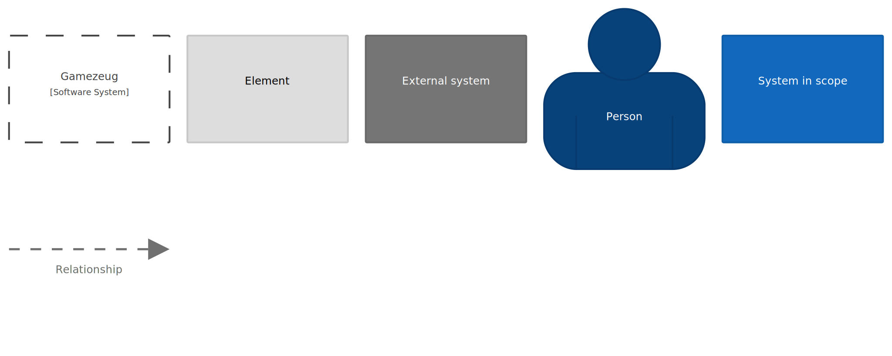

Introduction and Goals
======================

Welcome to the the architecture documentation of Gamezeug.
Gamezeug is a software development playground to try out new libraries, frameworks, methods, etc.

Requirements Overview
---------------------

The vision of Gamezeug is to provide an open source gaming platform with the following features:
- Gamer management
- Game table management
- Integration of web-based open source games
- Chat
- Statistics

All requirements are currently tracked in

System Scope and Context
========================

Glossary 
========

**Keys for the C4 Models**

**About arc42**

arc42, the Template for documentation of software and system
architecture.

By Dr. Gernot Starke, Dr. Peter Hruschka and contributors.

Template Revision: 7.0 EN (based on asciidoc), January 2017

© We acknowledge that this document uses material from the arc 42
architecture template, <http://www.arc42.de>. Created by Dr. Peter
Hruschka & Dr. Gernot Starke.

