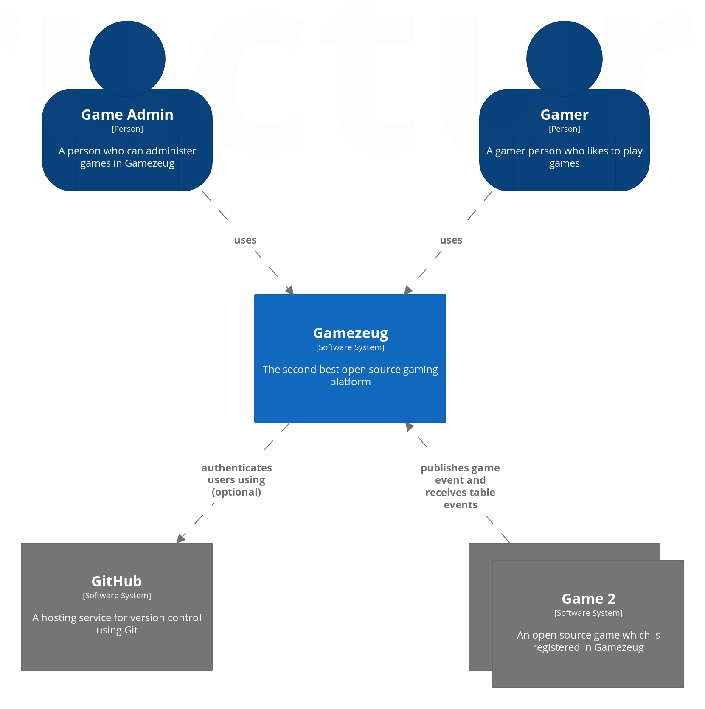
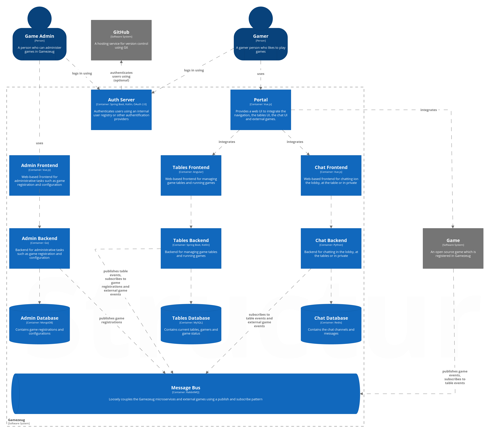
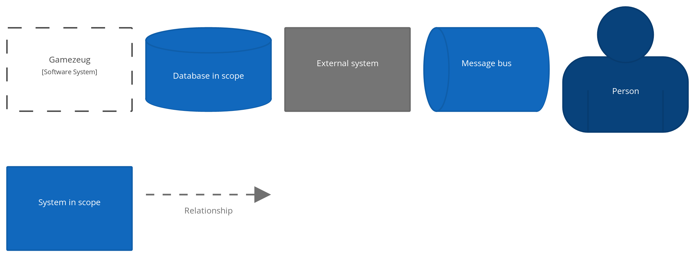

Introduction and Goals
======================

Welcome to the the architecture documentation of Gamezeug.
Gamezeug is a software development playground to try out new libraries, frameworks, methods, etc.

Requirements Overview
---------------------

The vision of Gamezeug is to provide an open source gaming platform with the following features:
- User (Gamer/Admin) management
- Game table management
- REST API for the integration of web-based open source games
- In-Game chat
- Statistics

All requirements are currently tracked in

System Scope and Context
========================

Building Block View
===================

Solution Strategy
=================

This chapter introduces some design decisions using frequently asked questions.

**Why are you using tons of difference technologies? Why not use a consistent technology stack?**

Because we can. No, seriously... Gamezeug is there to try out new stuff and have fun by learning.

**Isn't this architecture an overkill for the given requirements?**

Absolutely, it is. The goal was not to come up with a simple, efficient architecture.
If that was the case, the architecture probably wouldn't contain different programming languages, 
databases, multiple self contained systems or even containers.

This architecture was chosen to play around with self contained systems in this small scope.

**What are those cool diagrams?**

It is [the C4 model for software architecture](https://c4model.com/) by [Simon Brown](https://simonbrown.je/).

The Gamezeug diagrams were drawn by [Structurizr Express](https://www.structurizr.com).
The source files for the models can be found in this repository in the directory [c4model](/c4model).

Glossary 
========

**Keys for the C4 Models**

**About arc42**

arc42, the Template for documentation of software and system
architecture.

By Dr. Gernot Starke, Dr. Peter Hruschka and contributors.

Template Revision: 7.0 EN (based on asciidoc), January 2017

© We acknowledge that this document uses material from the arc 42
architecture template, <http://www.arc42.de>. Created by Dr. Peter
Hruschka & Dr. Gernot Starke.

